## Background

Worldwide, people are leading increasingly sedentary lifestyles.[^fn1] This phenomenon not only has a negative impact on the health of individuals, but it also places pressure on stretched, post-pandemic healthcare systems.[^fn2] Therefore, physical health outcomes within individuals’ control should be addressed to promote good health, as well as a functional health service. One way that individuals can address their health is through regular physical activity, which has been shown to reduce the risk and impact of both physical and mental illness.[^fn3] More recently, people are looking to technology for assistance with their physical health. This includes systems for engaging in exercise at home, such as Zwift or Peloton, and applications for recording physical activity, like Strava or Garmin Connect.[^fn4]

Health applications, sometimes referred to as mobile health interventions, often encourage habit formation through persuasive strategies such as self-monitoring and goal setting, with the aim of positively changing user behaviour.[^fn5] Although scheduling activity is positively correlated with improved activity engagement, the majority of these applications focus on enabling the user to track and view their completed activities.[^fn6] [^fn7] For example, on Strava, a popular exercise application with a social media component, users can record a physical activity, like a run, and review the activity when completed by scrolling through statistics and visualisations of pace, heart rate, and route map.[^fn8] Further, despite numerous health applications including persuasive strategies, and research indicating that their inclusion contributes to healthy behaviours, there is limited understanding as to what strategies are most appropriate for health and fitness applications. In addition to the lack of understanding regarding the efficacy of certain persuasive strategies in the context of physical activity, minimal research has been undertaken to understand how the strategies contribute to the usability and user experience of such an application.[^fn5][^fn7]

The project followed a modified version of the Stanford Design Thinking Process, to develop an interactive, high-fidelity prototype of the Coach application.[^fn9]

### What's the problem?

Health and fitness applications typically employ persuasive strategies to encourage the formation of healthy habits. Although persuasive strategies contribute to healthy behaviours, it is unclear what persuasive strategies are most appropriate for fitness applications aimed at helping users to schedule and record their physical activity, with the goal of changing or maintaining fitness behaviours. Further, the usability and user experience of applications that employ particular persuasive strategies is unknown.

This presents a problem, as the choice of persuasive design may negatively impact behavioural change or the usability and user experience, working in opposition to the goal of the application.

The A/B test conducted during the test phase sought to answer the following...How will users rate the usability and user experience of different persuasive strategies used to encourage scheduling of physical activity? Will the selected persuasive strategy contribute to increased scheduling of physical activities, which subsequently could contribute to higher engagement in exercise and the formation of exercise habits?

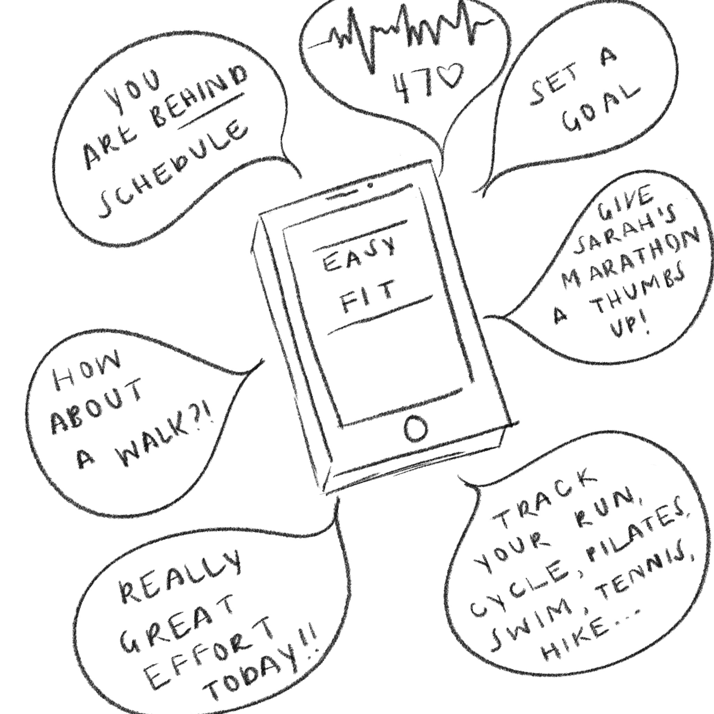

### Aims

1. Following the Stanford Design Thinking Process, conduct research to understand users' exercise barriers, behaviours, and motivations.
2. Design and usability test features of the prototype that use behavioural change techniques to quantify usability, user experience, and perceived efficacy.
3. Conduct an A/B test to compare three Reminder options that apply different persuasive features to inform the feature included on the final prototype iteration.
4. Design a high-fidelity, interactive prototype of an application to promote increased physical activity.

### Why approach the problem this way?

The Stanford Design Thinking Process was followed, with some modification, due to it’s non-linear and iterative approach. The approach was selected according to the project aim of creating a novel exercise application which employed tested persuasive strategies to promote a sustainable exercise practice, where no existing design solution existed. Alternative approaches, like Double Diamond or Design Sprints, were inappropriate as they assume existing designs requiring improvement, and processes like 3I by IDEO require diverse teams, rather than a sole researcher.[^fn9]

The Stanford Design Thinking Process was modified by adding a Test stage to test and compare persuasive strategies using usability and A/B testing. This addressed the dual aim of experimentally testing the usability and perceived efficacy of persuasive strategies, as well as designing an exercise application that included the tested behavioural change techniques.

Research has shown that most behavioural change applications include multiple persuasive strategies and that there is a limited understanding of what strategies are most effective in what contexts. Accordingly, behavioural change techniques included in the Coach prototype were tested for usability, user experience, and perception of efficacy to determine which ones were worth bringing forward into the second iteration of the application. Additionally, the A/B test component of the usability test compared three persuasive strategies for encouraging scheduling of physical activity. The goal was to identify the strategy that users perceived as most effective in encouraging scheduling, with the understanding that scheduling contributes to higher follow-through.

The Test stage with usability testing was included instead of a valence test or five-act interview which are classically employed in the Test stage of the Stanford Design Thinking Process as it was critical to go beyond users rate of satisfaction or dissatisfaction with particular features across the application, and instead focus on the usability and perceived efficacy of persuasive features. The justification for this decision, is that just because a user rates being satisfied with a feature, does not mean that they think the feature would contribute to increase scheduling or uptake of physical activity.

### Literature review

==Insert link to literature review document==

## Methodology

The project blended the Stanford Design Thinking methodology with usability testing and A/B testing methodology. This customised approach allowed for a user-centric and iterative approach to designing a high-fidelity prototype of a behavioural change intervention, while also testing the usability, user experience, and perceived efficacy of the persuasive features deployed in the prototype.

### Procedure

To address the aim of designing a high-fidelity prototype of the Coach application, with comprehensive consideration of persuasive strategies to encourage sustained behavioural change, a blend of structured methods was implemented. The methodology combined design thinking, following the Stanford Design Thinking Process, and a UX experiment.[^fn9][^fn10] The experiment included a usability and A/B test, completed during the Test stage of the Design Thinking Process.

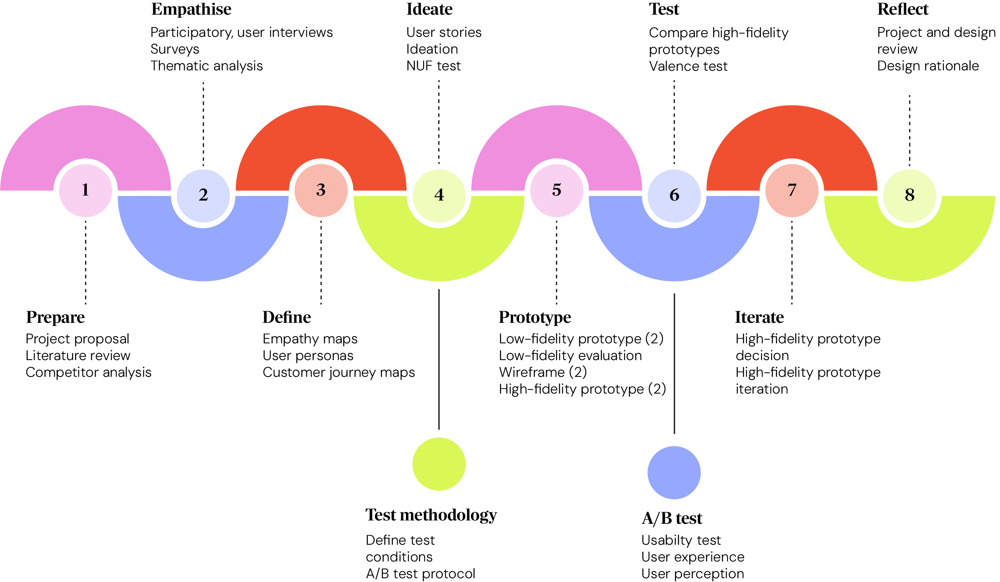

#### Design methodology

The project followed a modified Stanford Design Thinking Process, chosen for its iterative, solution-based approach to complex, poorly-defined problems. This methodology was essential for adopting a user-centric approach to address the complexity of behavioural change applications, while considering how motivation and personality impact persuasive strategy reception. Although the process is well-suited for this project, it is appreciated that design thinking, especially the ideation phase, tends to work best when applied in group brainstorming sessions and in cultures that promote play. As such, more innovative solutions to the problem statements may have been generated if the project was not completed by a single researcher. The methodology emphasises empathy, experimentation, and iteration—critical elements for designing effective behavioural change interventions that meet diverse user needs and preferences.

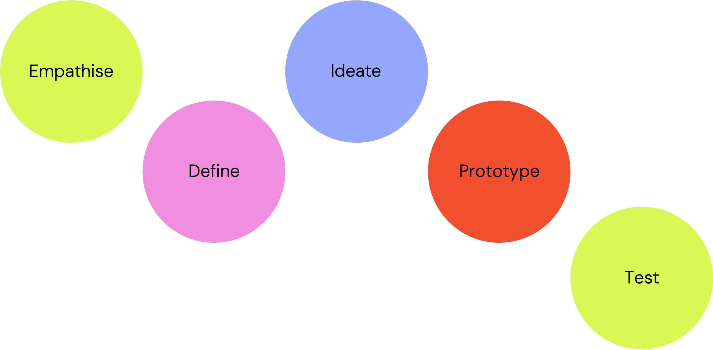

#### Test methodology

The Stanford Design Thinking process was modified to include a Test stage to address the project's experimental aim. Participants completed a usability test with tasks to evaluate the usability of the high-fidelity prototype, specifically the persuasive components. One task included an A/B test comparing two versions of the prototype to compare three persuasive strategies for encouraging exercise scheduling. Additionally, participants were asked to rate persuasive feature importance pre- and post-test and to complete self-report measures of user experience and perceived persuasiveness. The experiment aimed to determine the most appropriate persuasive features for exercise habit formation. The A/B component enabled direct comparison of prototype variants, while the usability test evaluated persuasive feature functionality alongside their impact on user experience and perceived efficacy.

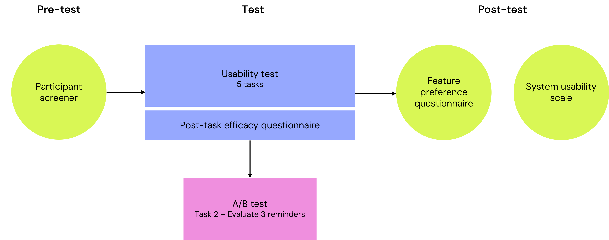

### Resources

#### Participants

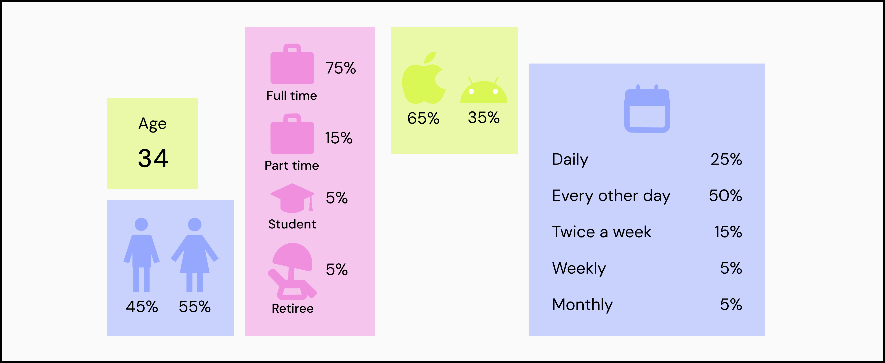

#### Design and experimental principles

The Persuasive Feature Preference Questionnaire distributed prior to user interviews and following usability testing was formulated with reference to persuasive strategies defined by Abraham and Michie.[^fn12] The reporting of the usability test followed the Common Industry Format (CIF). This included a System Usability Scale (SUS) to evaluate and compare the usability of the versions of the high-fidelity prototype.[^fn17] In addition to the standard CIF metrics of task success, assists, errors, and time on task, additional methods were included to assess and compare user experience of the high-fidelity prototype. These included a Post-Task Questionnaire to provide further insight into user experience and perceived efficacy of persuasive strategies included in the design.[^fn18][^fn19]

### Ethics

Ethical issues, including professional conduct, privacy and security, relevant legislation, and societal impact were considered from project proposal through to completion as required by the British Computer Society. Overall, the project presented limited ethical concerns, and in instances where there was a potential for ethical issues, these were addressed.

#### Ethical concerns

The project presented no ethical concerns. In all instances, the researcher was transparent to ensure that participants were adequately informed about the research. Additionally, prior to surveys, user interviews, low-fidelity evaluations, and high-fidelity evaluations, participants were provided with a Participant Information Sheet, outlining details such as the right to withdraw, potential risks, the purpose of the study, as well as any conceivable ethical issues, irrespective of severity or likelihood. Participants were also asked to sign a Participant Informed Consent Form to confirm that they understood the project, the voluntary nature of their participation, and the potential risks and benefits. Furthermore, all data that was collected was held securely and confidentially, in an anonymised state.

#### Professional concerns

The Code of Professional Conduct of the User Experience Professional Association (UXPA) was adhered to throughout the project. This included being honest with all participants, ensuring that no one was deliberately misinformed or mislead.[^fn20] The researcher conducted the project and created the associated material for distribution with consideration for professionalism and discrimination. Additionally, all intellectual property was credited in instances where it was referenced. Further, there were no known conflicts of interest.

#### Legal concerns

As a high-fidelity prototype, the Coach application presents no legal concerns. In the event that the Coach application was fully developed and deployed to market in the United Kingdom, it would be considered as an eHealth intervention, likely requiring it to follow health application legislation outlined by the Government. As the application is focused on promoting exercise and improving physical health, there would be potential overlap with community healthcare services, and as such, registration with the Care Quality Commission (CQC) could be required. Furthermore, as the Coach application would provide research-backed material on the benefits of exercise and recommended physical activity, it would need to meet the NHS Clinical Risk Management Standards requirements. Furthermore, NHS Information Governance requirements and the Data Protection Act would need to be abided by when storing confidential health information.[^fn21] Accordingly, if the Coach application was developed and deployed in other countries, relevant health authority legislation would need to be followed, such as the Health Insurance Portability and Accountability Act (HIPAA) in the United States of America.[^fn22]

#### Data protection concerns

All data collected during surveys, user interviews, low-fidelity evaluations, and high-fidelity testing through the Participant Screener was confidential, anonymised, and stored in a secure location. Participants were informed that the data would be kept for a maximum of 10 years prior to being digitally erased or destroyed using confidential waste disposal methods. If the Coach application was deployed, it would handle personal information related to a user’s physical health. If released in the United Kingdom, Coach would be required to adhere to the regulations outlined in the Data Protection Act 2018.[^fn23] Similarly, if the Coach application was available in other nations, it would be required to follow the relevant data protection legislation, such as the Privacy Act of 1974 in the United States of America or the General Data Protection Regulation (GDPR) in Europe.[^fn24] [^fn25]

#### Societal concerns

The project did not present any societal concerns and if developed, the Coach application would not present any societal concerns. All steps were taken to avoid harm to participants, and all were treated without discrimination on the basis of age, race, gender, gender identity, national origin, religion, disability, socioeconomic status, or sexual orientation. Further, no information with potential for use to discriminate such as voting preferences, would be collected by the Coach application Additionally, where health data was collected, it would only be utilised to ensure that suggested physical activities would not exacerbate a user’s health condition and that the physical activity would be possible for the user.

### Accessibility

Accessibility guidelines outlined in WCAG were followed to ensure that the Coach application was accessible for users of all abilities to enjoy.[^fn16] Some guidelines that were followed included giving links and buttons meaningful names, checking the colour contrast, ensuring that important information was not only specified by colour, using consistent navigation, such as back arrows, and using consistent components like primary and secondary buttons, radio buttons, and dropdown menus. Further care was taken to ensure that headings were informative, multiple web pages had multiple ways that they could be accessed, layout was linear and consistent, and users had sufficient time to read content.

## Prepare

The initial stage of the project focused on understanding the state of the field of eHealth applications, behavioural change techniques, and habit formation to inform research methodology and application design. This included conducting secondary research to draft a project proposal, to ensure that the project would adhere to ethical guidelines and module requirements. Additionally, secondary research informed the literature review, and literature on behavioural change and persuasive strategies informed the Test stage experimental design, which was iteratively refined based on user interviews and early evaluation. Secondary research also identified research gaps (e.g. limited behavioural change technique testing in physical activity contexts), application shortcomings (e.g. lack of user-created training plans, fragmented activity logging), and potential competitors. This informed the problem statement, which outlined the focus of the application and was used to guide the design process. The gaps in research also provided the basis for the research question, which the experimental component aimed to address.

### Competitor analysis

Applications with similar premises to Coach were identified through primary and secondary research, and selected based on popularity (i.e. number of downloads in the Apple App Store and mentions in research) and inclusion of persuasive strategies (e.g. self-monitoring through tracking of activities and display of associated metrics). A competitor analysis was conducted to visualise the state of the market state and identify standard practices in physical health applications (e.g. activity dashboards, tracking options, social components). Analysis revealed application strengths (e.g. Garmin Connect's in-depth data visualisation) and weaknesses (e.g. device requirements, lack of scheduling features). Gaps in the market were identified, and taken with secondary research, informed the Coach application scope and features.

Competitor applications typically included the ability to track and record physical activities, the option to add friends, and the opportunity to view progress through data visualisation. As these are expected functionalities, they were included in the Coach application. Additionally, common persuasive features included self-monitoring (e.g. tracking of exercise), rewards (e.g. trophies and acknowledgement of personal best efforts), and social support (e.g. the option to connect with and motivate peers) were noted in each of the applications, and as such were tested and included in the prototype. Finally, analysis identified opportunities for improvement and the expansion of current offerings to better meet user needs. For example, while all applications encouraged activity tracking, the majority did not include options to schedule activity, make training plans, or set personalised goals. Accordingly, competitor analysis directly shaped design decisions by highlighting opportunities for differentiation and user needs not addressed by existing solutions.

## Empathise

The initial stage provided an understanding of behavioural change techniques, as well as competitors of the Coach application. This informed early brainstorming about potential features and identified areas to be explored with users, such as barriers to physical activity, perception of persuasive strategies, the impact of motivation, and how users plan and set exercise goals.

The second stage provided insight into the experience of users, including their motivation and barriers toward exercise. Surveys and user interviews were conducted to ensure that the design of the Coach application was user-centric. Qualitative and quantitative analyses informed the subsequent problem statement, inclusion of persuasive features, decision of what persuasive features to test, and the overall design of the Coach application.

### Data collection

#### Survey

==Insert link to survey document==

A two-part survey was distributed to 20 participants (age 22 to 60) to understand users’ thoughts and behaviours toward physical activity, behaviour change, and motivation. The first section collected demographic data, technology usage, and exercise behaviours. Section two asked users to rate statements about motivation and persuasive strategies like self-monitoring, social support, and goal setting on a 7-point Likert scale. The results indicated that 90% of participants use a physical activity application and 75% use a wearable device. Moreover, they revealed two distinct user groups - casual exercisers struggling with motivation and rigorous exercisers interested in tracking and planning. This shaped subsequent user interview questions and highlighted the need to investigate user perception toward persuasive features.

<!-- 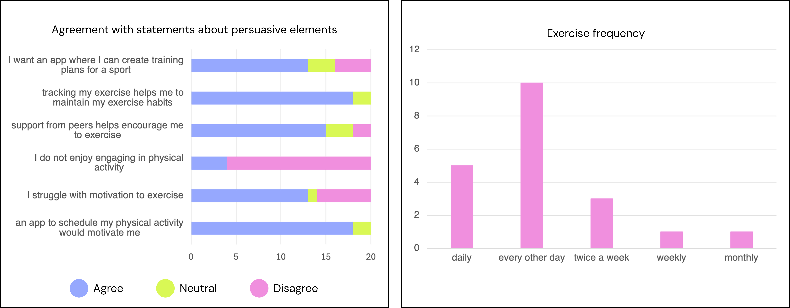 -->

#### User interviews

==Insert link to interview questions==

Semi-structured, 30 to 45 minute user interviews were conducted to provide a more complete view into users’ relationships with exercise, barriers to exercise, technology used when exercising, behaviours such as exercise frequency, planning, and tracking of exercise, as well as opinions toward exercise including motivation and preferred form of encouragement. Two interviews were conducted face-to-face and one was conducted remotely. The initial goal was to interview two users who fit within the first projected user group and two users who fit within the second projected user group. Unfortunately, it proved challenging to find a second user who engaged in regimented and frequent exercise with specific training goals in mind. Ultimately, the researcher included auto-ethnography to fill the recruitment gap, adding their own experience of training for half-marathons and a marathon whilst completing the project to further inform user needs and barriers. The user interviews informed the user personas, customer journey maps, and the design of features included in the Coach application.

Due to challenges recruiting a participant for the user interview who qualified for the seasoned athlete user group, auto-ethnography was included. This involved the researcher considering their own experience of physical activity by exploring the user interview questions.28 As the researcher was immersed in training for a marathon as the study topic was being developed, it provided an ideal opportunity to consider how they viewed exercise, motivation, encouragement, and feature preferences. The data from the auto-ethnography was combined with the user interview data to be qualitatively and quantitatively analysed.

#### Participatory design

At the end of the user interview, participants were asked to walkthrough the features of an exercise application that they used and their feelings toward it (i.e. likes and dislikes). Two participants spoke about their experience with Strava and one discussed Garmin Connect.

#### Questionnaires

Prior to the user interview, participants were asked to complete a Participant Screener to collect demographic data. To be invited for a user interview, two participants were required to exercise over six hours a week and to schedule exercises, while the other two participants were required to have an interest in regular exercise and difficulty motivating. This criteria ensured that detailed information was collected from both potential user groups, while also avoiding interviewing only individuals from one group.

Following the user interview and participatory design, participants were asked to complete a Self-Report Habit Index and a Persuasive Feature Preference Questionnaire. The Self-Report Habit Index included 12 statements about exercise that participants were asked to rate their agreement with on a 7-point Likert scale, providing insight into the strength of participants’ exercise habits and gave nuance to their interview responses.[^fn26] Participants averaged from 3.2 to 6.5 on the Habit Index, with the majority scoring at 4.5 and below, which indicated that users had low to moderate exercise habits.

The Persuasive Feature Preference Questionnaire was designed by the researcher using persuasive features outlined in Aldenaini and colleagues review.[^fn27] The questionnaire included 16 persuasive strategies, including their name, a brief description, and an example. Participants were asked to rate their preference for each feature on a 7-point Likert scale from “really dislike” to “really like”. This allowed for quantification of users’ preferences toward persuasive features. In combination with secondary findings on the popularity of persuasive features, this informed the features included in the Coach application.

==Insert link to three questionnaire materials==

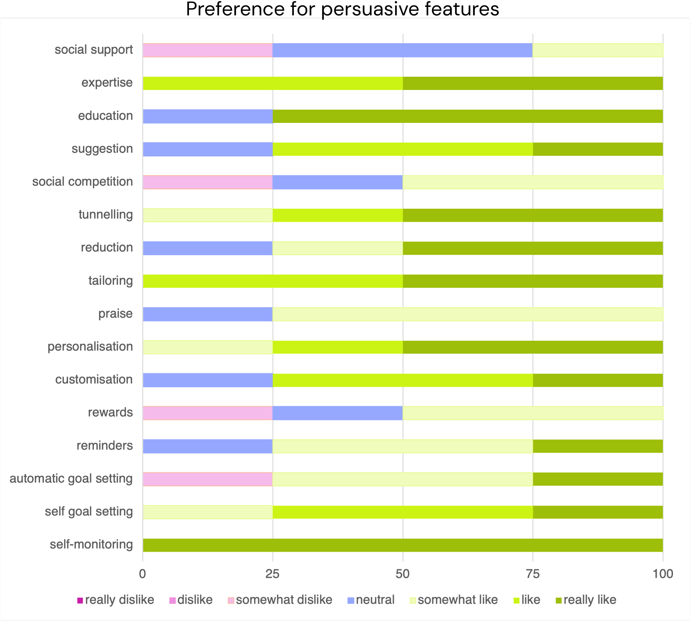

### Qualitative analysis

User interviews and auto-ethnography were recorded and transcribed. The dataset was qualitatively analysed using a thematic analysis technique called affinity diagramming. This included highlighting key ideas and insights from the transcripts, summarising the data on individual post-it notes, coding the data, adding quotations, grouping the codes into themes, and drawing connections between the codes and themes. The goal of the analysis was to identify patterns in the data, which could be addressed through the design of the Coach application. The key themes included user opinions and values, behaviours, pain points, motivation, habit formation, views toward persuasive features, and needs.

#### Theme 1: Opinions and values

The users’ feelings toward exercise, the benefits of physical activity, and what they dislike about physical activity.

- Aware of the physical and mental health benefits of exercise
- See exercise as a priority
- Physical activity that is purely completed for fitness can feel like an obligation
- Increasing the awareness of the importance of exercise with age
- Partake in sport for enjoyment and health

“Physical activity is a part of who I am. On the rare days when I don’t exercise, my mental health suffers and I’m generally pretty irritable.”

#### Theme 2: Behaviours

The physical activity that the user engages in and how it had changed.

- Type and frequency of exercise has changed with age
- Variety of exercise preferences (e.g. swimming, racket sports, weightlifting, kayaking, etc.)
- Mix of solo and team sports

“As I got older, I found it harder to keep up exercise habits... I didn’t necessarily find the time and opportunity to [exercise].”

#### Theme 3: Motivation

What users find motivational or demotivating when trying to engage in exercise.

- Scheduling and having to book exercises in advance increases accountability
- Seeing progress and achieving PBs is motivating
- Viewing tracked activities and the associated statistics is motivating
- Comparing themselves to peers is demotivating
- Time taken to reach a goal can be demotivating
- Not seeing progress is demotivating

“I’m not very realistic with my goals... When I’m finding that a goal is taking ages to get to, it’s really demotivating.”

#### Theme 4: Habit formation

How users build exercise habits and the habits that they have formed.

- Most users have rough weekly habits to engage in exercise a certain number of times
- Exercise anywhere from once a day to once a week
- Schedules and planning help to build exercise habits
- Peers hold them accountable and help them to build an exercise routine
- User calendar applications to plan exercise
- Most users try to schedule activity in advance, using their local calendar

“My job is my biggest deterrent in being able to form habits... I find if you set habits in a job like mine, you will fail, and then you will feel negative.”

#### Theme 5: Views toward persuasive strategies

Users’ reactions and opinions on different persuasive strategies that are commonly employed in behavioural change interventions.

- All users are interested in setting goals, but struggle with keep them realistic
- Many users try to schedule activities or see the importance of scheduling an activity to maintain a routine
- All users preferred constructive criticism as encouragement, with suggested ways on how they could improve
- Users are interested in seeing their progress and the data and educational material associated with their activities
- Reminders should take a variety of forms
- Users viewed monitoring their activity as important and motivating

“Some kind if explanation... scientific research that you could read alongside the metric to understand it a bit more.”

#### Theme 6: Needs

The features and other elements that users require to help them develop and maintain and exercise routine.

- Integration with their daily calendar for easy scheduling
- Personalised reminders
- A way to see progress (e.g. awards, comparisons to previous activities)
- Optional social support and a way to encourage other users before they start an activity
- Tracking for a range of physical activities
- In-depth statistics with associated educational material that is scientifically backed
- Assistance with goal setting and the creation of training plans
- A method for recording the details of their exercise (e.g. reps and sets)
- A way to plan a route and link it to an activity

“It would be nice for it to help you book and find time to do an activity, and for it to hold you accountable to it.”

==Insert download for qualitative analysis==

## Define

Data gathered during the Empathise stage was organised to define a problem statement that would guide the project, while focusing on the needs of the users uncovered in the previous stage. The quantitative and qualitative data was interpreted using empathy maps, user personas, customer journey maps, point of view statements, and user stories. This user and journey visualisation ensured user-centred application design based on real user motivations and needs. The synthesised data resulted in actionable problem statements that enabled potential solution generation in the following Ideation stage.[^fn9][^fn10]

### Empathy maps

Two empathy maps were created using the qualitative and quantitative findings from previous stages. This helped to visualise the attitudes and behaviours of core user groups, ensuring prioritisation of user needs throughout and revealing any missing user data.[^fn9][^fn10][^fn29] The result was a refined understanding of the two user groups, from which user personas were generated.

The two defined user groups were:

1. **Seasoned athletes:** These users engage daily, or at minimum every other day, in physical activity. They generally feel motivated to exercise and spend time planning, tracking, and reflecting on their physical activity. They require limited encouragement, but they do need in-depth scheduling for daily activities and long-range training plans. Additionally, they require that a system offers integration with their wearable devices and local calendar. Most importantly, these users want a tailored approach to scheduling and recording their physical activity that is flexible, while offering opportunities to set goals and create exercise plans.
2. **Exercise enthusiasts:** These users engage in a range of physical activity on a semi-regular basis. Their motivation fluctuates, and at times motivation and external barriers such as employment, stop them from maintaining a regular exercise schedule. They are keen to maintain exercise habits but have found it difficult to schedule their activity and set goals in a way that works for them. They require low-effort scheduling, assistance with goal setting, credible and accessible performance metrics, and options for personalisation. Moreover, these users are sometimes motivated by social support and are negatively impacted by forms of encouragement that stoke feelings of guilt for not exercising.

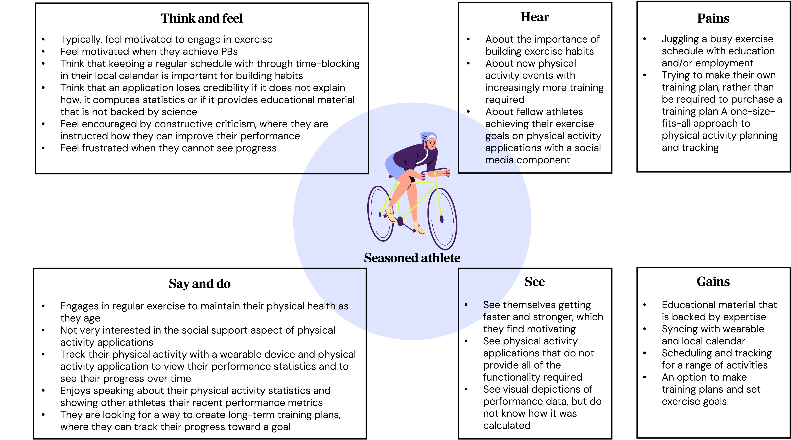

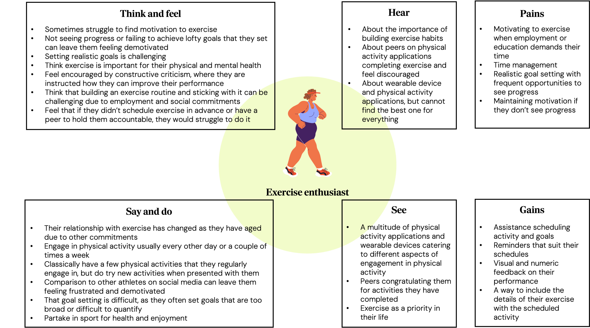

### User personas

A user persona is a fictional target user that is based on real information about users gathered in the Empathise stage. The personas focused on characteristics of a user and their life that had an impact on the design of the Coach application.[^fn9][^fn10][^fn30] For example, empathy maps and user personas provided insight into core features for the Coach application, such as flexible planning, self- and system-generated goal setting, and a detailed personalisation flow. This brought users from the abstract into individuals that the researcher could empathise with and focus on during development. Further, user personas guided the creation of customer journey maps.

Using the categorised information about user groups shown in the empathy maps and the wider data from the Empathise stage, two user personas were generated:

1. **Kayla:** This is the primary user, who is in the seasoned athlete user group. They work a busy full-time job and are completing triathlon training. They are generally very motivated, require in-depth planning, and want limited, tailored encouragement. They want an application that sees them through all stages of physical activity.
2. **George:** This is the secondary user, who is in the exercise enthusiast user group. They wake up early and work full-time, engaging in a range of physical activity semi-regularly. They have fluctuating motivation, require planning and some encouragement, and want to use technology to exercise, only if it is not distracting or difficult to integrate.

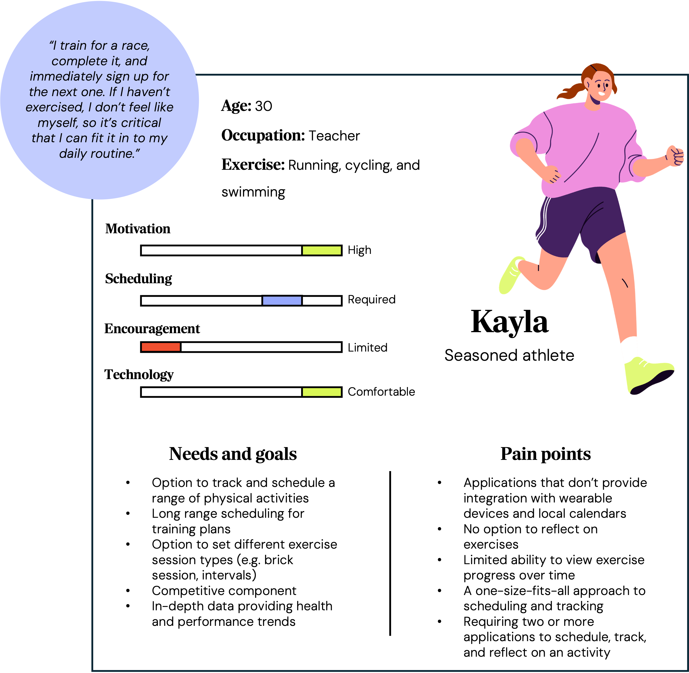

### Customer journey maps

Customer journey maps were developed for both personas to visualise users' goals, actions, thoughts, and emotions across time, encouraging a holistic view of the user and to provide insight into what their experience with the Coach application would look like. This provided an understanding of where to focus to maximise user experience, and shaped decisions on what aspects of the application to develop and test in future stages.[^fn9][^fn10][^fn31]

For example, Kayla's journey map revealed the need for broad functionality that users can adjust for distinct training plans, with behavioural change techniques operating in the background that the user can attend to as they feel necessary. George's journey map highlighted the importance of reminders and encouragement for accountability, plus the need for goal-setting assistance and educational material about exercise benefits and performance metrics.

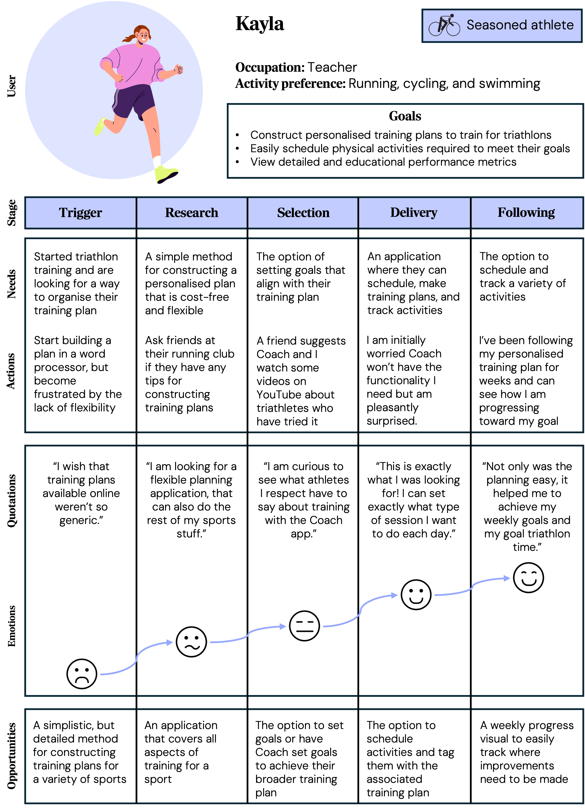

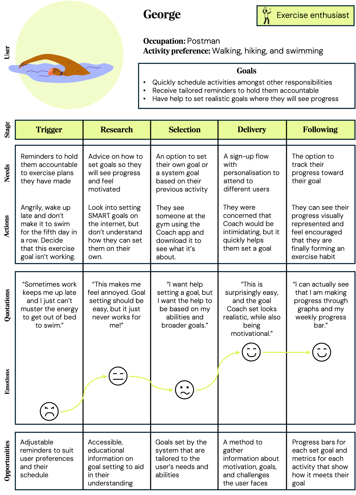

### Point of view statements

With the two user groups in mind, point of view statements were written to define the problem that the project aimed to solve. This prevented spending resources on ideating and prototyping potential solutions to a poorly defined problem. Point of view (i.e. problem statements) were used to summarise who the users are,
what their needs are, and why these needs are important. By completing point of view statements, this reduced the scope of the problem and provided a success metric for future stages in the design process.[^fn9][^fn10][^fn29] Overall, these statements captured what the project aimed to achieve, which was a personalised behavioural change intervention to promote regular exercise and
habit formation through persuasive strategies such as scheduling, self-monitoring, reminders, suggestions, and goal setting.

The statements followed the format: [user] needs to [user need] because [insight].

Statement examples:

1. “As a forty-something accountant with a busy schedule, I want an application that provides integration with my local calendar, so that scheduling exercise and remembering to exercise is easier.”
2. “As a woman who always sets New Year resolutions, I want adjustable goal setting, so that I can set and meet realistic goals, and to provide a form of encouragement.”
3. “As someone working in data visualisation, I want in-depth data on fitness trends, so that I have a complete understanding of each activity and my progress.”

==Insert point of view statement table (maybe?)==

### User stories

The user personas, customer journeys, and point of view statements were referenced to create user stories. These short statements were about potential application features, from the perspective of the user.[^fn9][^fn10][^fn32] These included features like creating an account, integration with other systems and devices, scheduling and tracking capabilities, and opportunities to view progress and receive encouragement. The stories outlined what the users were hoping to achieve, including tracking through their wearable device, insight into performance progress to motivate them, and encouragement from peers to maintain healthy habits. In the Ideation stage, this allowed the researcher to brainstorm the optimal way to meet the users need through the implementation of features like a schedule and system-generated goal setting.

The user stories followed the format: As a [user] I want to [action] so that [objective].

==Insert user stories table (maybe?)==

## Ideate

The fourth stage involved approaching the users’ problems curiously and creatively through a range of ideation techniques. The goal was to identify out-of-the-box solutions that addressed problems identified during the Empathise stage and understood further through the Define stage.[^fn9][^fn10] Four ideation methods were employed to construct a range of ideas to solve five key issues raised during the Empathise stage. The ideas were rated and the ideas that received the highest score were brought forward as features to be included in the Coach prototype.

### _How might we_ questions

"How might we" questions were constructed to frame the user problems outlined in the Define stage. The goal was to focus on the core issues voiced by users during primary research, such as planning and goal setting, to ensure that real user issues were being addressed. The questions were referenced in each of the ideation techniques to focus on core user issues and stimulate creative thinking.[^fn9][^fn10][^fn33]

The how might we questions followed the format: How might we [meet the need stated in the user point of view statement]?

_How might we_ questions:

1. How might we encourage scheduling of a physical activity so that users follow
   through with exercise?
2. How might we make it easy and convenient to schedule physical activity to increase the likelihood of a user engaging in exercise?
3. How might we track and display a range of physical activities, so it is intuitive for
   users to understand?
4. How might we enable users to reflect on their physical activity so that they can identify areas for improvement?
5. How might we promote setting realistic and attainable goals so that users can see their progress and feel encouraged?

### Rapid idea generation

Rapid idea generation was the first methodology employed to brainstorm solutions to the how might we questions. The researcher set a timer for two minutes per how might we statement and wrote down as many ideas as possible within that timeframe. Some of the solutions, such as performance metrics displayed as graphs to view progress, suggested goals, scheduling organised with dropdown menus, and reminders for scheduling activity, were taken forward and edited during the Prototype stage. Additionally, some were expanded upon through sketching following the Crazy Eights strategy.

==Insert download for rapid idea generation==

### Crazy eights

A second ideation method that was employed, borrowed from the Design Sprint methodology, was Crazy Eights. This involved folding a piece of paper into eight sections and sketching a potential solution for a _how might we statement_ every minute, for eight minutes.[^fn10][^fn34] Like rapid ideation, the goal was to consider a range of potential solutions. Ideas that were brought forward from Crazy Eights into the Prototype stage included:

1. SMART goal setting and goal progress bars
2. A journal resembling a physical journal for reflection
3. Tracked activities displayed as cards with the associated metrics
4. Activity selection for a dropdown list
5. A pop-up confirming the connection with a wearable device
6. Multiple calendar views
7. A scheduling screen with easy input fields
8. Pop-up reminders to schedule activity
9. Rewards.

### Worst case scenarios

Finally, worst case scenarios were generated for each _how might we_ statement. For this ideation method, the researcher purposefully considered the worst solutions to the problem. The goal of the process was to stoke creativity and to challenge the researcher’s assumptions through examining the ideas.[^fn9][^fn10][^fn30] For example, these scenarios stressed this importance of reminders that can be personalised, a system that accounts for numerous activities, data visualisation, flexible reflection and goal setting, and suggestions informed by real user data.

==Insert worst case scenario tables?==

### NUF test

To complete the Ideation stage and decide what ideas should be brought forward to prototyping, a NUF exercise was completed. This involved using a matrix to plot each idea generated through the ideation methods against the other three columns – new, useful, and feasible. Each idea was scored from 1 to 10 (10 being the most desirable) on each criterion.[^fn9][^fn10][^fn29] The goal was to consider the ideas from different perspectives, to uncover any uncertainties around ideas, and to create a feature list of the highest scoring ideas to be taken forward to the Prototype stage.

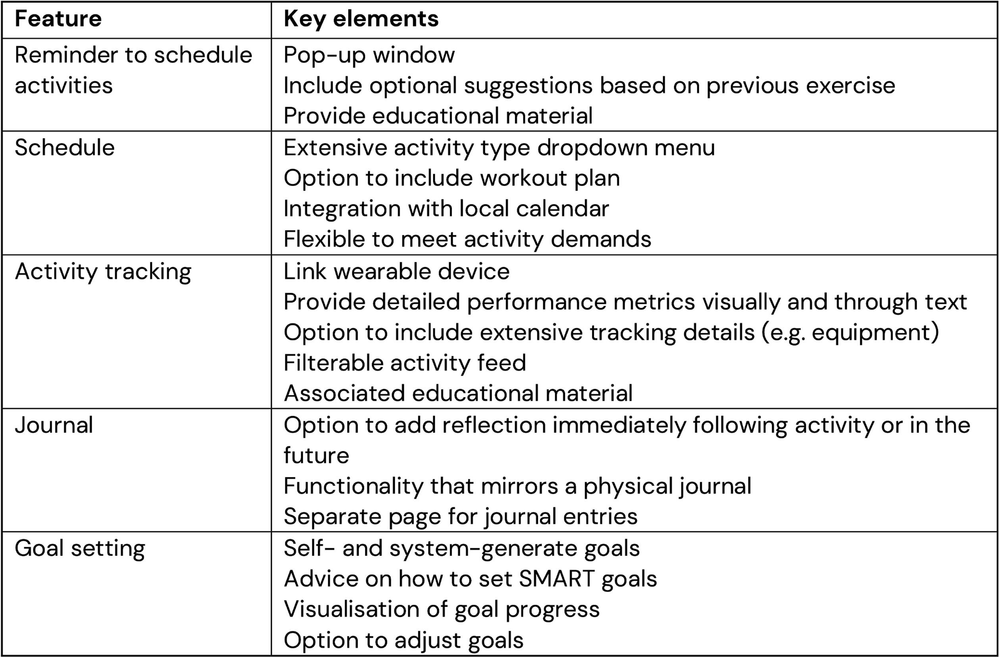

## Prototype

The fifth stage involved creating increasingly detailed, but scaled down versions, of the Coach application. This involved drawing and testing a low-fidelity, paper prototype, drafting a wireframe and wire flow to show core components and connections between features, and a high-fidelity prototype of the Coach application, including interactivity and three versions of the scheduling reminder. The goal was to gradually implement features identified in the Empathise and Ideation stage, to consider how they could work together in an application to meet users’ need. This allowed the researcher to visualise their ideas, test the practicality of initial design solutions, and to bring the testable prototype forward to the Test stage to consider usability, user experience, and perception of the core persuasive features.[^fn9][^fn10]

### Low fidelity prototype

To begin to implement the features outlined in the Ideation stage, a low-fidelity prototype was drafted. The goal was to visualise the core design features of the Coach application in their simplest form to identify any gaps and to begin to consider how the system would function. The low fidelity prototype was evaluated and provided a basis from which to design the wireframe.[^fn9][^fn10]

Core features and their associated persuasive strategies included in the low-fidelity prototype were:

1. The onboarding flow – Personalisation
2. Schedule and training plans – Planning
3. Reminders to schedule activity - Reminders, education, and suggestions
4. Activity tracking – Self-monitoring
5. Goal setting – Self- and system-goal setting

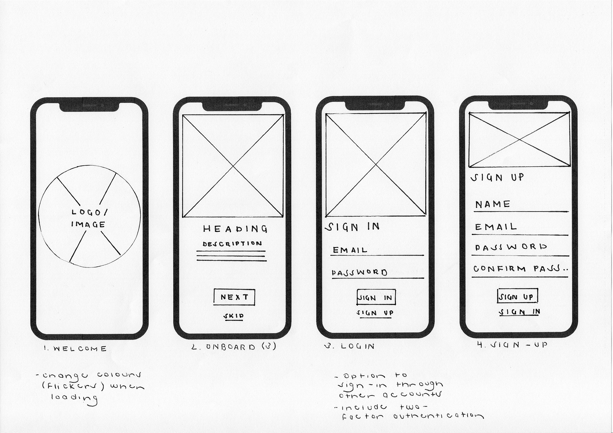

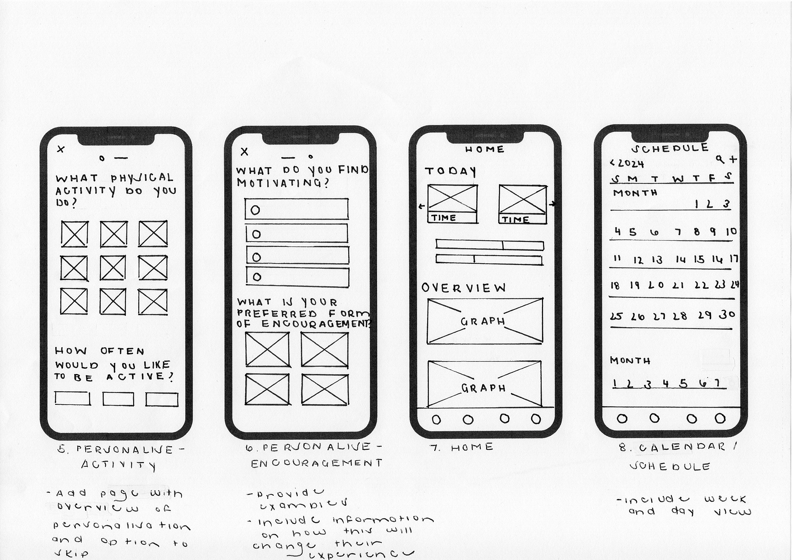

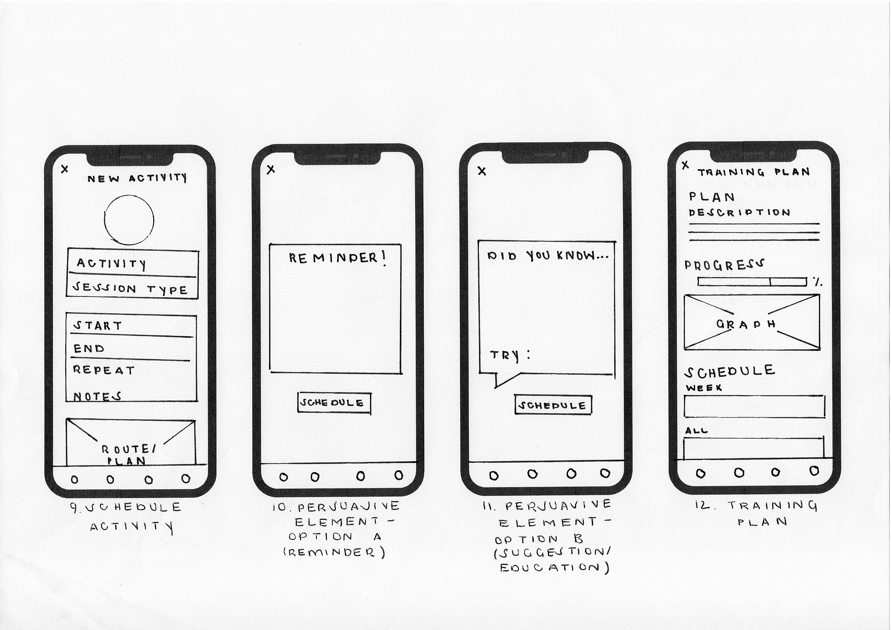

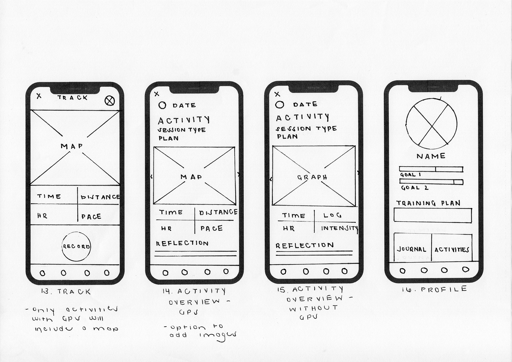

#### Low fidelity evaluation

The low-fidelity prototype was evaluated in brief, twenty-minute sessions by four participants. An explanation of the Coach application was provided and the participants were given a scenario to evaluate the prototype. During the evaluation, participants were asked to think aloud, noting areas that they thought could be improved. The feedback from the participants was considered and the most popular suggestions with the highest projected value to users were addressed.

==Insert low fidelity evaluation table==

### Wireframe

Following low-fidelity evaluation, a wireframe was created using Figma. The wireframe provided a rough, schematic diagram of the Coach application. The goal was to implement changes suggested by users in the low-fidelity evaluation, as well as to expand on the user interface and think about how the application would be structured (e.g. what pages were required). Further, the wireframe allowed the researcher to consider the layout of content and the requirements of each page to meet the user needs outlined in the Empathise stage.[^fn9][^fn10][^fn14] For example, during the user interviews, users highlighted a need for the schedule to link to their local calendar, the need to input session details for the activity that they want to schedule, and a preference to receive reminders about scheduled events. These requirements were input in the wireframe, which included two reminder possibilities (later expanded to three), and various dropdown and text field inputs for activity details.

#### Wireflow

The wireframe was used to create a wireflow to visualise interactions within the Coach application.[^fn9][^fn10][^fn35] The wireframe with wireflow includes how pages connect (red arrows), clickable components (green dots), and pop-up windows (pink triangles). Further, this allowed the researcher to identify any issues regarding how pages were connected. For example, prior to creating the wireflow it was not considered how the user would access the Activity Feed, as it did not include an icon on the navigation bar or any button on the Home or Profile pages. The wireflow was used to inform the interactions that were included in the high-fidelity prototype, such as horizontally scrolling carousels, buttons that changed orientation with a click, and dropdown menus for activity selection.

==Insert wireflow image==

### Moodboard

A mood board was created to assist in developing the design system, which was referenced when designing the high-fidelity prototype. This provided a visual guide to organise potential design options, such as visual branding, UI elements, and application features.[^fn10][^fn36] To stimulate creativity, images, objects, fonts, icons, interactions, features, and UI elements were explored and a
digital collage was created using Miro. The mood board helped to identify a colour scheme (i.e. lime green, poppy red, periwinkle blue, and bubble gum pink), typography (i.e. a classic serif), and the overall aesthetic, which aimed to align with 1980s fitness advertisements and fashion. Further, features and interactions like an infinite scrolling activity feed and tracking metrics with progressive disclosure, as well as iconography shaped after Olympic pictograms, were identified.

==Insert moodboard image==

### Design system

A design system was developed from the inspiration provided by the mood board. The design system outlined design standards and building blocks of the Coach application to ensure a consistent experience across the application.[^fn10][^fn37] The system was designed with inspiration from the 1980s fitness aesthetic, with the goal of promoting the enjoyment of physical activity through a bold serif font and playful colour palette. Illustrations and some iconography were sourced from the Noun Project and Adobe Stock.

==Insert design system image==

#### Iconography

Due to their prevalence across the application in selection panes and activity categorisation, extra consideration was given to the design of the icons. Icons are non-verbal representations to assist users to find information. The icons were designed by the researcher in Adobe Illustrator with inspiration from the 1988 Korean Olympics pictograms. The goal was to make activities easily recognisable for a range of users and to create a balance between text and visuals across the application. Further, the iconography aimed to evoke the fun and competitive nature of the Olympics, while also contributing to a consistent feel across the Coach application.

==Insert iconography image==

### High fidelity prototype

Finally, a high-fidelity prototype of the Coach application was created in Figma. This provided a polished simulation of the Coach application, including interactivity, real content, and consideration for visual design.[^fn9][^fn10] The high-fidelity prototype included the following sections:

1. Loading and sign-up or sign-in
2. Onboarding
3. Dashboard
4. Reminders to schedule
5. Performance metric overview
6. Schedule (day, week, and month)
7. Schedule an activity and plan a route
8. View scheduled activity and associated route
9. Create a workout plan
10. Journal
11. Personal and other athlete’s activity feed
12. Activity overview
13. Activity tracking with wearable connection
14. Self- and system-generated goal setting
15. Goal overview
16. Awards

The reasons for including each section were carefully considered, including the needs of the user and behavioural change techniques. The prototype included three versions of the reminder to schedule activities, each employing a different persuasive strategy. The goal of the prototype was to simulate the Coach application, so that the usability, user experience, and perception of persuasive features could be tested, to finalise the features included in the final product. Due to the importance of planning and reminders in behavioural change, special consideration was given to the reminders to schedule, so that A/B testing could be conducted to evaluate the most effective option.

==Insert high fidelity prototype images==

==Insert walkthrough video of prototype==

#### Feature options for comparison

==Insert images comparing features==

## Test

The Test stage was a core component of the project, as the number of persuasive strategies employed in behavioural change interventions is high, but the research into what strategies are the more effective in what contexts is limited. Therefore, the Test stage included usability testing, including consideration of user experience and perception of persuasive strategy efficacy, and A/B testing of three versions of the Reminder to schedule. The goal was to test the usability, user experience, and perception of persuasive features included in the Coach application to understand what features the users preferred and felt would be most effective in changing their behaviour. This information informed the final iteration of the Coach application, and if expanded on in the future, would inform which features were implemented first in the product.

### Test protocol

The test session was a semi-structured combination of a usability test and an A/B test. It lasted 45 minutes to an hour and included five tasks. Four participants completed the test session. The participant was provided with an overview of the Coach application and the test process, and a think aloud protocol was demonstrated prior to starting the test. The test was recorded, and notes were scribed by the researcher throughout. Following each task, the participant was asked to complete a Post-Task Questionnaire, where they responded to one to three statements about their perception of the persuasive feature tested.

The second task was an A/B test to compare three versions of the Reminder to schedule a physical activity. The participant was situated on the Dashboard of the Coach application and a Reminder was shown. After each Reminder they were asked to respond to two statements about their perception of the Reminder.

The tasks evaluated user perception of the core persuasive features that were included in the application based off of primary and secondary research. This included creating a profile (personalisation), scheduling a physical activity (planning), viewing metrics associated with physical activities and users’ physical health (education and expertise), viewing reminders (reminder, suggestion, educational content), exploring completed activities (self-monitoring), setting goals (self- and system-goal setting), and encouraging other users in their activities (social support and competition).

Following the test, the participant was asked to complete a System Usability Scale (SUS) to measure the usability of Coach, as well as the Persuasive Preference Questionnaire to measure their preference for persuasive strategies after viewing the Coach application.

==Insert test protocol diagram==

### Test results

Responses to the Post-Task Questionnaire were generally positive, with participants rating the majority of the persuasive features that were implemented as likely to contribute to increased engagement with exercise. Participants perceived that personalisation, scheduling, and goal setting would cause them to be more likely to exercise. Alternatively, education, expertise, and social support was regarded as less likely to cause behaviour change. Participant responses to the Feature Preference Questionnaire aligned with these findings, with self-monitoring, self-goal setting, and personalisation being highly regarded.

==Insert test results figures==

Throughout the test, participants spoke aloud to provide qualitative feedback on their experience of the user interface and components that could be improved. Users’ comments about the system were generally positive and suggestive of it having a positive user experience. The researcher assigned a priority level to each piece of feedback to identify what should be addressed in the second iteration of the design.

==Insert participant feedback table==

Finally, the usability of the system was evaluated through errors, assists, time on task, and the System Usability Scale. Participants did not go over the allotted time and no participant made an error, suggesting good usability. Additionally, three of the participants only required two assists, with the majority of assists focusing on navigation. Moreover, the SUS scores ranged from 72.5 to 97.5, with an average score of 86.9. This indicated that the users felt that the Coach application had acceptable usability.

#### A/B test results

With regard to the A/B test, 75% of participants preferred the Reminder that included no educational content and no suggestion (i.e. Reminder 1). Of note, the Reminder with the suggestion rated well amongst 75% of participants regarding it’s perceived efficacy in promoting behavioural change, but one participant “strongly disagreed” that it would make them more likely to exercise.

==Insert A/B test results figures==

## Iterate

After testing the initial version of the high-fidelity prototype of the Coach application, it was iterated upon to create the final version for this project. The features that were iterated on were those that the participants found high and medium priority issues with during the usability test. Other changes that were made were mostly aesthetic and to increase functionality. Some important features that were iterated on was the carousel for selection of motivation type, the layout of the Dashboard screen, the navigation of the Schedule, the location of the Athletes’ Activity Feed, and text size throughout.

==Insert iteration images==

In addition to the changes above, the second task of the usability test informed the Reminder to schedule that was selected for the final version of the high-fidelity prototype. Ultimately, one reminder was not selected, but rather two Reminders would be implemented if Coach was developed. The basic Reminder would be the primary reminder available, but users would be able to opt-in to reminders with suggestions, as this Reminder (i.e. Reminder 2) rated highly among the majority of users.

## Conclusion

A review was completed following iteration to consider the results, their validity, and their potential implications. Further, any shortcomings of the project were addressed and their impact on the outcome was considered. The entirety of the project and the associated findings was contrasted to previous findings in the field of behavioural change and persuasive, mobile design.

The predominant findings from the design and testing the Coach application was that there is seemingly no one-size-fits-all approach exists for promoting behavioural change in the physical activity domain. While secondary research showed most mHealth applications use multiple persuasive strategies, the Coach application demonstrated that individual generally favour a few tailored strategies and that this approach correlates well with usability. Key findings included:

1. Social Features are Polarising - Half of the participants found peer support motivating while the other half disagreed. Comparison to peers was sometimes perceived as discouraging, suggesting social support should be optional.
2. Personalisation is Critical - Users consistently emphasised their unique physical activity preferences, capabilities, and challenges, indicating flexible features that adapt to user behaviour and motivation style are essential.
3. Persuasive Feature Preference is Personal - Half of the participants found peer support motivating while the other half disagreed. Comparison to peers was sometimes perceived as discouraging, suggesting social support should be optional.
4. Considered Persuasive Features Correlate with Usability - The application focused on implementing tested behavioural change techniques, as opposed to numerous untested strategies. Participants responded favourably with an average SUS score of 86.9, indicating excellent usability.

### Certainty and uncertainty

The project produced some clear results, that could be used to inform future iterations or related work, but also some questions, that require further investigation.

Regarding clear outcomes, there was an overall positive response to persuasive strategies. Users appeared to attend to the ones that worked for them, and rated the ones that they were less keen on as neutral, rather than demotivating or frustrating. This suggests that persuasive features can be applied liberally, and that users will find what works for them, providing it is accessible. Secondly, throughout primary research and testing, it was obvious that users care about personalisation. Discussion often centred around distinct physical activity preferences, capabilities, and challenges that the user felt were specific to them, but important. As such, the implementation of flexible features that are adjusted according to use behaviour and feedback, are likely to improve product outcome. Further, there is not a one-size-fits- all approach to persuasive strategies. While some techniques were regarded as positive by all participants, other techniques resulted in no conclusive opinion. Similar to the previous suggestion, it insinuates that multiple strategies should be employed, especially those that rate highly with all users.

There were other outcomes that require further investigation. First, it is unclear whether someone’s perception of a persuasive strategy’s efficacy would actually contribute to behavioural change. A fully developed application that participants could test over time would be required to evaluate this. Further, users’ perception of efficacy of strategies could be impacted by the prototype, rather than the strategy itself. Therefore, it’s challenging to untangle whether a strategy purely contributes to behavioural change regardless of the application, or whether the design of the strategy within the application is equally as important. Finally, the initial visual design goal, was to pull from the 1980s fitness aesthetic. Although the design is cohesive and mostly successful in invoking this era, it is unclear whether its distinct look in comparison to more streamlined, neutral exercise applications would be a hinderance to its uptake.

### Limitations

There were multiple limitations that should be held in mind when considering the project’s outcome. First, due to challenges recruiting participants, the number of participants engaging in surveys, user interviews, and prototype evaluations and tests could have been larger. Additionally, the small group size contributes to a lack of diversity, including many participants being in the same age group (e.g. 30s) and a lack of variety in preferred physical activities. Similarly, as the majority of the participants were convenience sampled, all interview and test participants did not have children. As factors such as employment and education were often referenced as barriers to consistent exercise, it is feasible that raising children would impact someone’s ability to find time to exercise. Moreover, as previously mentioned, testing the usability, experience, and perception of prototype features provides an indication of how the developed Coach application would perform, but due to limited interactivity, the outcomes are not conclusive. Similarly, as the application was not fully developed, participants could not test the application over time or test the full usability of the application. As such, it is not clear how it would impact behavioural change, especially habit formation over time. Finally, the study is subject to report bias. As users were asked to imagine how they would react, there is the possibility that they provided feedback that they thought the researcher would want to hear or that could make them more likeable, rather than their realistic opinions.

### Future work

As the Coach application is in the early stages high-fidelity prototyping, there is potential for future work. Of particular interest would be to expand the personalisation flow to include motivation and personality quizzes to further meet the diverse needs of users. Additionally, this would help to provide insight into how these factors impact efficacy of persuasive strategies. Further, when designing the Coach application, the design of the scheduling component was based off of brief discussions with users and reference to calendar applications. As such, testing the effect of different scheduling options on behaviour as well as user experience would help to implement a feature that would work for more users. Similarly, more research is required into a variety of physical activities to understand what tracking and performance metrics would be helpful for users. Finally, as the educational material did not receive the expected response, it would be valuable to test different approaches for presenting the material, to conclude whether it was the content, the strategy, or the design.

==Insert loading image==

## References

[^fn1]: Park, J., Moon, J., Kim, H., Kong, M., and Oh, Y. (2020) ‘Sedentary lifestyle: Overview of updated evidence of potential health risks’, Korean Journal of Family Medicine, 41(6), pp.365-373.

[^fn2]: World Health Organization (2022) Covid-19 has caused major disruptions and backlogs in health care, new WHO study finds. Available at: https://www.who.int/europe/news/item/20-07-2022-covid-19-has-caused-major-disruptions-and-backlogs-in-health-care--new-who-study-finds.

[^fn3]: US Centers for Disease Control and Prevention (2024) Benefits of physical activity. Available at:https://www.cdc.gov/physical-activity-basics/benefits/CDC_AAref_Val=https://www.cdc.gov/physicalactivity/basics/pa-health/index.htm

[^fn4]: Sullivan, A. and Lachman, M. (2017) ‘Behaviour change with fitness technology in sedentary adults: A review of the evidence for increasing physical activity’, Frontiers in Public Health, 4. Available at: https://www.frontiersin.org/journals/public-health/articles/10.3389/fpubh.2016.00289/full

[^fn5]: Alqahtani, F., Khalifah, G., Oyebode, O., and Orji, R. (2019) ‘Apps for mental health: An evaluation of behavioural change strategies and recommendations for future development’, Frontiers in Artificial Intelligence, 2(30).

[^fn6]: Rodgers, W., Hall, C.,, Blanchard, C., McAuley, E., and Munroe, K. (2002) ‘Task and scheduling self-efficacy as predicators of exercise behaviour’, Psychology and Health, 17(4), pp. 405-416.

[^fn7]: Knight, E., et al. (2015) ‘Physical health guidelines for physical activity: Is there an app for that? A review of Android and Apple app stores’, JMIR mHealth and uHealth, 3(2).

[^fn8]: Strava (2024). Available at: https://www.strava.com/.

[^fn9]: d.school (2024) Get started with design thinking. Available at: https://dschool.stanford.edu/resources/getting-started-with-design-thinking.

[^fn10]: Stanford, J., et al. (2017) What is design thinking?, O’Reilly Media.

[^fn11]: Harjumaa, M. and Oinas-Kukkonen, H. (2009) ‘Persausive systems design: Key issues, process model, and system features’, Communications of the Association for Information Systems, 24, pp. 485-500.

[^fn12]: Abraham, C. and Michie, S. (2008) ‘A taxonomy of behaviour change techniques used in interventions’, Health Psychology, 27, pp. 379-387.

[^fn13]: Apple Developer (2024) Designing for iOS. Available at: https://developer.apple.com/design/human-interface-guidelines/designing-for-ios.

[^fn14]: Hannah, J. (2023) ‘The ultimate guide to mobile app design: Follow these UI principles and best practices’, UX Design Institute. Available at: https://www.uxdesigninstitute.com/blog/ultimate-guide-to-mobile-app-design/.

[^fn15]: UK Home Office (2024) Designing for accessibility. Available at: https://ukhomeoffice.github.io/accessibility-posters/posters/accessibility-posters.pdf.

[^fn16]: Web Accessibility Initiative (2024). Available at: https://www.w3.org/WAI/standards-guidelines/wcag/.

[^fn17]: Brooke, J. (1996) ‘SUS: A quick and dirty usability scale’, Usability Evaluation in Industry, London: Taylor & Francis.

[^fn18]: Schrepp, M., Hinderks, A., and Thomaschewski, J. (2017) ‘Design and evaluation of a short version of the User Experience Questionnaire (UEQ-S)’, International Journal of Interactive Multimedia and Artificial Intelligence, 4(103).

[^fn19]: Albert, W. and Tullis, T., 2023. Measuring the User Experience. Cambridge: Elsevier.

[^fn20]: UXPA International (2024) UXPA code of professional conduct. Available at: https://uxpa.org/uxpa-code-of-professional-conduct/#:~:text=Act with Integrity,-4.1.&text=UX practitioners shall not discriminate,any basis proscribed%-0by%20law.

[^fn21]: Public Health England (2017) Criteria for health app assessment. Available at: https://www.gov.uk/government/publications/health-app-assessment-criteria/criteria-for-health-app-assessment#:~:text=Commission ( CQC ) registration-,Medical device regulation,be regulated by the MHRA .

[^fn22]: US Department of Health and Human Services (2024) Resources for mobile health app developers. Available at: https://www.hhs.gov/hipaa/for-professionals/special-topics/health-apps/index.html.

[^fn23]: [Gov.uk](http://Gov.uk) (2024) Data protection. Available at: https://www.gov.uk/data-protection.

[^fn24]: Office of Privacy and Civil Liberties (2024) Privacy Act of 1974. Available at: https://www.justice.gov/opcl/privacy-act-1974.

[^fn25]: European Council (2024) The general data protection regulation. Available at: https://www.consilium.europa.eu/en/policies/data-protection/data-protection-regulation/#:~:text=data protection rules-,What is the GDPR%3F,the 1995 data protection directive.

[^fn26]: Gardner, B., et al. (2012) ‘Towards parsimony in habit measurement: Testing the convergent and predictive validity of an automaticity subscale of the Self-Report Habit Index’, International Journal of Behavioural Nutrition and Physical Activity, 9.

[^fn27]: Aldenaini, N., Alslaity, A., Sampalli, S., and Orji, R. (2023) ‘Persuasive strategies and their implementations in mobile interventions for physical activity: A systematic review’, International Journal of Human-Computer Interaction, 39(12), pp. 2292-2338.

[^fn28]: Ward, J. (2024) Embracing subjectivity: Using autoethnography in UX research. Available at: https://dscout.com/people-nerds/using-autoethnography.

[^fn29]: Gibbons, S. (2018) Empathy mapping: The first step in design thinking. Available at: https://www.nngroup.com/articles/empathy-mapping/.

[^fn30]: Harley, A. (2015) Personas make users memorable for product team members. Available at: https://www.nngroup.com/articles/persona/.

[^fn31]: Kaplan, K. (2016) When and how to create customer journey maps. Available at: https://www.nngroup.com/articles/customer-journey-mapping/.

[^fn32]: Kayley, A. (2021) Mapping user stories in Agile. Available at: https://www.nngroup.com/articles/user-story-mapping/.

[^fn33]: Rosala, M. (2021) Using how might we questions to ideate on the right problems. Available at: https://www.nngroup.com/articles/how-might-we-questions/.

[^fn34]: Stevenson, H. (2019) How to run a crazy eights workshop. Available at: https://blog.prototypr.io/how-to-run-a-crazy-eights-workshop-60d0a67b29a.

[^fn35]: Laubheimer, P. (2016) Wireflows: A UX deliverable for workflows and apps. Available at: https://www.nngroup.com/articles/wireflows/.

[^fn36]: Yang, L. (2023) Mood boards in UX: How and why to use them. Available at: https://www.nngroup.com/articles/mood-boards/.

[^fn37]: Fessenden, T. (2021) Design systems 101. Available at: https://www.nngroup.com/articles/design-systems-101/.
