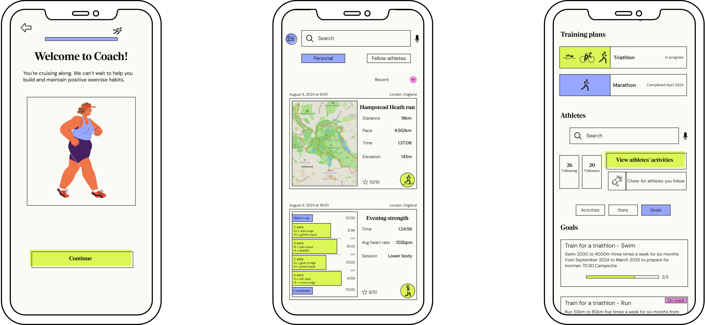
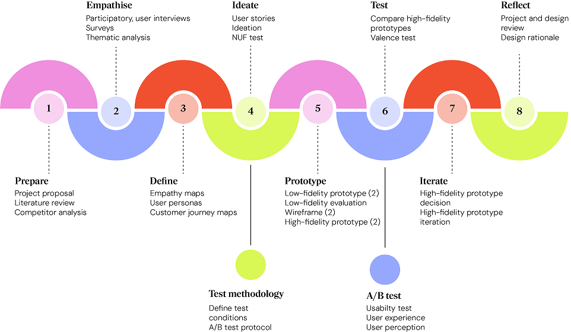
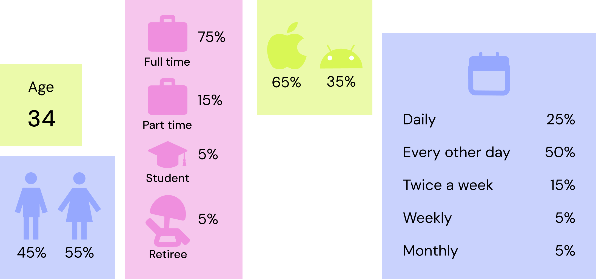
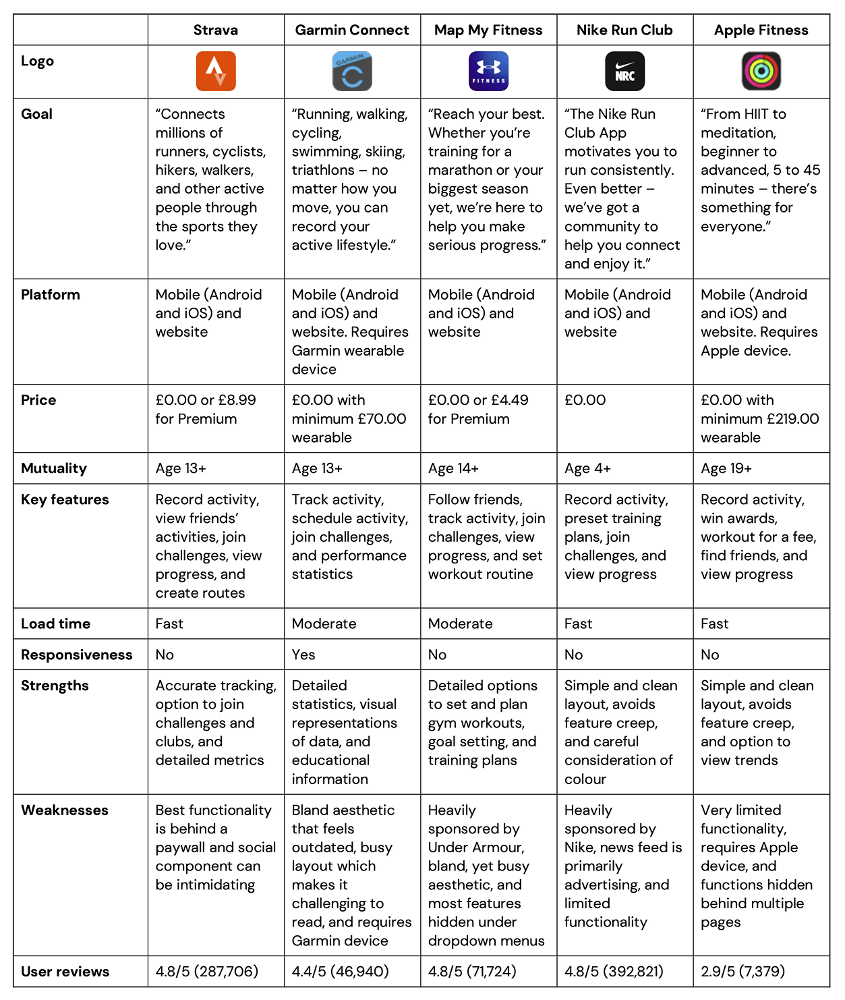
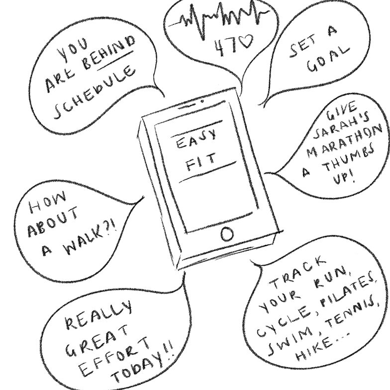

import ProjectProblemImage from '../../assets/01-coach/project-problem.png';

import Demo from '../../components/Demo.astro';
import SectionCollapsible from '../../components/project/SectionCollapsible.astro';
import SectionDownloadButton from '../../components/project/SectionDownloadButton.astro';
import SectionTextBoxes from '../../components/project/SectionTextBoxes.astro';
import SectionTextFullWidth from '../../components/project/SectionTextFullWidth.astro';
import SectionTextLeft from '../../components/project/SectionTextLeft.astro';
import SectionTextPartialWidth from '../../components/project/SectionTextPartialWidth.astro';
import SectionTextRight from '../../components/project/SectionTextRight.astro';
import TextBox from '../../components/project/TextBox.astro';

### Overview

## Background

<SectionTextFullWidth>

    Worldwide, people are leading increasingly sedentary lifestyles (Park et al., 2020). This phenomenon not only has a negative impact on the health of individuals, but it also places pressure on stretched, post-pandemic healthcare systems (World Health Organization, 2022). Therefore, physical health outcomes within individuals’ control should be addressed to promote good health, as well as a functional health service. One way that individuals can address their health is through regular physical activity, which has been shown to reduce the risk and impact of both physical and mental illness (US Centers for Disease Control and Prevention, 2024). More recently, people are looking to technology for assistance with their physical health. This includes systems for engaging in exercise at home, such as Zwift or Peloton, and applications for recording physical activity, like Strava or Garmin Connect (Sullivan and Lachman, 2017).

    Health applications, sometimes referred to as mobile health interventions, often encourage habit formation through persuasive strategies such as self-monitoring and goal setting, with the aim of positively changing user behaviour (Alqahtani et al., 2019). Although scheduling activity is positively correlated with improved activity engagement, the majority of these applications focus on enabling the user to track and view their completed activities (Rodgers et al., 2002; Knight et al., 2015). For example, on Strava, a popular exercise application with a social media component, users can record a physical activity, like a run, and review the activity when completed by scrolling through statistics and visualisations of pace, heart rate, and route map (Strava, 2024). Further, despite numerous health applications including persuasive strategies, and research indicating that their inclusion contributes to healthy behaviours, there is limited understanding as to what strategies are most appropriate for health and fitness applications. In addition to the lack of understanding regarding the efficacy of certain persuasive strategies in the context of physical activity, minimal research has been undertaken to understand how the strategies contribute to the usability and user experience of such an application (Knight et al., 2015; Alqahtani et al., 2019).

    The project followed a modified version of the Stanford Design Thinking Process, to develop an interactive, high-fidelity prototype of the Coach application (d.school, 2024).

</SectionTextFullWidth>

### What's the problem?

<SectionTextLeft image={ProjectProblemImage} imageAlt='A description of my image.' imageHeight={360}>

    Health and fitness applications typically employ persuasive strategies to encourage the formation of healthy habits. Although persuasive strategies contribute to healthy behaviours, it is unclear what persuasive strategies are most appropriate for fitness applications aimed at helping users to schedule and record their physical activity, with the goal of changing or maintaining fitness behaviours. Further, the usability and user experience of applications that employ particular persuasive strategies is unknown.

    This presents a problem, as the choice of persuasive design may negatively impact behavioural change or the usability and user experience, working in opposition to the goal of the application.

</SectionTextLeft>

The A/B test conducted during the test phase sought to answer the following...

<SectionTextFullWidth>

    How will users rate the usability and user experience of different persuasive strategies used to encourage scheduling of physical activity? Will the selected persuasive strategy contribute to increased scheduling of physical activities, which subsequently could contribute to higher engagement in exercise and the formation of exercise habits?

</SectionTextFullWidth>

### Aims

<SectionTextBoxes>

    Following the Stanford Design Thinking Process, conduct research to understand users' exercise barriers, behaviours, and motivations.

    Design and usability test features of the prototype that use behavioural change techniques to quantify usability, user experience, and perceived efficacy.

    Conduct an A/B test to compare three Reminder options that apply different persuasive features to inform the feature included on the final prototype iteration.

    Design a high-fidelity, interactive prototype of an application to promote increased physical activity.

</SectionTextBoxes>

### Why approach the problem this way?

The Stanford Design Thinking Process was followed, with some modification, due to it’s non-linear and iterative approach. The approach was selected according to the project aim of creating a novel exercise application which employed tested persuasive strategies to promote a sustainable exercise practice, where no existing design solution existed. Alternative approaches, like Double Diamond or Design Sprints, were inappropriate as they assume existing designs requiring improvement, and processes like 3I by IDEO require diverse teams, rather than a sole researcher.

The Stanford Design Thinking Process was modified by adding a Test stage to test and compare persuasive strategies using usability and A/B testing. This addressed the dual aim of experimentally testing the usability and perceived efficacy of persuasive strategies, as well as designing an exercise application that included the tested behavioural change techniques.

<SectionCollapsible>

    Research has shown that most behavioural change applications include multiple persuasive strategies and that there is a limited understanding of what strategies are most effective in what contexts. Accordingly, behavioural change techniques included in the Coach prototype were tested for usability, user experience, and perception of efficacy to determine which ones were worth bringing forward into the second iteration of the application. Additionally, the A/B test component of the usability test compared three persuasive strategies for encouraging scheduling of physical activity. The goal was to identify the strategy that users perceived as most effective in encouraging scheduling, with the understanding that scheduling contributes to higher follow-through.

    The Test stage with usability testing was included instead of a valence test or five-act interview which are classically employed in the Test stage of the Stanford Design Thinking Process as it was critical to go beyond users rate of satisfaction or dissatisfaction with particular features across the application, and instead focus on the usability and perceived efficacy of persuasive features. The justification for this decision, is that just because a user rates being satisfied with a feature, does not mean that they think the feature would contribute to increase scheduling or uptake of physical activity.

</SectionCollapsible>

### Literature Review

<SectionDownloadButton fileName="coach-literature-review.pdf" >

    Download literature review

</SectionDownloadButton>

## Methodology

<SectionTextFullWidth>

    The project blended the Stanford Design Thinking methodology with usability
    testing and A/B testing methodology. This customised approach allowed for a
    user-centric and iterative approach to designing a high-fidelity prototype of
    a behavioural change intervention, while also testing the usability, user
    experience, and perceived efficacy of the persuasive features deployed in the
    prototype.

</SectionTextFullWidth>

### Procedure

<SectionTextFullWidth>

    To address the aim of designing a high-fidelity prototype of the Coach application, with comprehensive consideration of persuasive strategies to encourage sustained behavioural change, a blend of structured methods was implemented. The methodology combined design thinking, following the Stanford Design Thinking Process, and a UX experiment.9,10 The experiment included a usability and A/B test, completed during the Test stage of the Design Thinking Process.

</SectionTextFullWidth>

<SectionCollapsible>

    #### Design Methodology

    <SectionTextLeft image={ProjectProblemImage} imageAlt='A description of my image.' imageHeight={360}>

        The project followed a modified Stanford Design Thinking Process, chosen for its iterative, solution-based approach to complex, poorly-defined problems. This methodology was essential for adopting a user-centric approach to address the complexity of behavioural change applications, while considering how motivation and personality impact persuasive strategy reception. Although the process is well-suited for this project, it is appreciated that design thinking, especially the ideation phase, tends to work best when applied in group brainstorming sessions and in cultures that promote play. As such, more innovative solutions to the problem statements may have been generated if the project was not completed by a single researcher. The methodology emphasises empathy, experimentation, and iteration—critical elements for designing effective behavioural change interventions that meet diverse user needs and preferences.

    </SectionTextLeft>

    ####  Methodology

    <SectionTextLeft image={ProjectProblemImage} imageAlt='A description of my image.' imageHeight={360}>

        The Stanford Design Thinking process was modified to include a  Test stage to address the project's experimental aim. Participants completed a usability test with tasks to evaluate the usability of the high-fidelity prototype, specifically the persuasive components. One task included an A/B test comparing two versions of the prototype to compare three persuasive strategies for encouraging exercise scheduling. Additionally, participants were asked to rate persuasive feature importance pre- and post-test and to complete self-report measures of user experience and perceived persuasiveness. The experiment aimed to determine the most appropriate persuasive features for exercise habit formation. The A/B component enabled direct comparison of prototype variants, while the usability test evaluated persuasive feature functionality alongside their impact on user experience and perceived efficacy.

    </SectionTextLeft>

</SectionCollapsible>

### Resources

#### Participants

<SectionTextPartialWidth>

</SectionTextPartialWidth>

#### Design and Experimental Principles

<SectionTextFullWidth>

    To decide what persuasive strategies to employ and how, the work of Harjumaa and Oinas-Kukkonen and Abraham and Michie was consulted.11, 12 The mobile prototype was designed according to accessibility principles and following design principles for mobile, specifically the Apple platform.13-16

    The Persuasive Feature Preference Questionnaire distributed prior to user interviews and following usability testing was formulated with reference to persuasive strategies defined by Abraham and Michie.12 The reporting of the usability test followed the Common Industry Format (CIF). This included a System Usability Scale (SUS) to evaluate and compare the usability of the versions of the high-fidelity prototype.17 In addition to the standard CIF metrics of task success, assists, errors, and time on task, additional methods were included to assess and compare user experience of the high-fidelity prototype. These included a Post-Task Questionnaire to provide further insight into user experience and perceived efficacy of persuasive strategies included in the design.18, 19

</SectionTextFullWidth>

### Ethics

Ethical issues, including professional conduct, privacy and security, relevant legislation, and societal impact were considered from project proposal through to completion as required by the British Computer Society. Overall, the project presented limited ethical concerns, and in instances where there was a potential for ethical issues, these were addressed.

<SectionCollapsible>

    #### Ethical Concerns

    The project presented no ethical concerns. In all instances, the researcher was transparent to ensure that participants were adequately informed about the research. Additionally, prior to surveys, user interviews, low-fidelity evaluations, and high-fidelity evaluations, participants were provided with a Participant Information Sheet, outlining details such as the right to withdraw, potential risks, the purpose of the study, as well as any conceivable ethical issues, irrespective of severity or likelihood. Participants were also asked to sign a Participant Informed Consent Form to confirm that they understood the project, the voluntary nature of their participation, and the potential risks and benefits. Furthermore, all data that was collected was held securely and confidentially, in an anonymised state.
    Professional Concerns

    The Code of Professional Conduct of the User Experience Professional Association (UXPA) was adhered to throughout the project. This included being honest with all participants, ensuring that no one was deliberately misinformed or mislead.20 The researcher conducted the project and created the associated material for distribution with consideration for professionalism and discrimination. Additionally, all intellectual property was credited in instances where it was referenced. Further, there were no known conflicts of interest.

    #### Legal Concerns

    As a high-fidelity prototype, the Coach application presents no legal concerns. In the event that the Coach application was fully developed and deployed to market in the United Kingdom, it would be considered as an eHealth intervention, likely requiring it to follow health application legislation outlined by the Government. As the application is focused on promoting exercise and improving physical health, there would be potential overlap with community healthcare services, and as such, registration with the Care Quality Commission (CQC) could be required. Furthermore, as the Coach application would provide research-backed material on the benefits of exercise and recommended physical activity, it would need to meet the NHS Clinical Risk Management Standards requirements. Furthermore, NHS Information Governance requirements and the Data Protection Act would need to be abided by when storing confidential health information.21 Accordingly, if the Coach application was developed and deployed in other countries, relevant health authority legislation would need to be followed, such as the Health Insurance Portability and Accountability Act (HIPAA) in the United States of America.22

    #### Data Protection Concerns

    All data collected during surveys, user interviews, low-fidelity evaluations, and high-fidelity testing through the Participant Screener was confidential, anonymised, and stored in a secure location. Participants were informed that the data would be kept for a maximum of 10 years prior to being digitally erased or destroyed using confidential waste disposal methods. If the Coach application was deployed, it would handle personal information related to a user’s physical health. If released in the United Kingdom, Coach would be required to adhere to the regulations outlined in the Data Protection Act 2018.23 Similarly, if the Coach application was available in other nations, it would be required to follow the relevant data protection legislation, such as the Privacy Act of 1974 in the United States of America or the General Data Protection Regulation (GDPR) in Europe.24, 25

    #### Societal Concerns

    The project did not present any societal concerns and if developed, the Coach application would not present any societal concerns. All steps were taken to avoid harm to participants, and all were treated without discrimination on the basis of age, race, gender, gender identity, national origin, religion, disability, socioeconomic status, or sexual orientation. Further, no information with potential for use to discriminate such as voting preferences, would be collected by the Coach application Additionally, where health data was collected, it would only be utilised to ensure that suggested physical activities would not exacerbate a user’s health condition and that the physical activity would be possible for the user.

</SectionCollapsible>

#### Accessibility

<SectionTextRight shape="circle">

    Accessibility guidelines outlined in WCAG were followed to ensure that the Coach application was accessible for users of all abilities to enjoy.16 Some guidelines that were followed included giving links and buttons meaningful names, checking the colour contrast, ensuring that important information was not only specified by colour, using consistent navigation, such as back arrows, and using consistent components like primary and secondary buttons, radio buttons, and dropdown menus. Further care was taken to ensure that headings were informative, multiple web pages had multiple ways that they could be accessed, layout was linear and consistent, and users had sufficient time to read content.

</SectionTextRight>

## Prepare

<SectionTextRight>

    The initial stage of the project focused on understanding the state of the field of eHealth applications, behavioural change techniques, and habit formation to inform research methodology and application design. This included conducting secondary research to draft a project proposal, to ensure that the project would adhere to ethical guidelines and module requirements. Additionally, secondary research informed the literature review, and literature on behavioural change and persuasive strategies informed the Test stage experimental design, which was iteratively refined based on user interviews and early evaluation. Secondary research also identified research gaps (e.g. limited behavioural change technique testing in physical activity contexts), application shortcomings (e.g. lack of user-created training plans, fragmented activity logging), and potential competitors. This informed the problem statement, which outlined the focus of the application and was used to guide the design process. The gaps in research also provided the basis for the research question, which the experimental component aimed to address.

</SectionTextRight>

### Competitor Analysis

<SectionTextFullWidth>

    Applications with similar premises to Coach were identified through primary and secondary research, and selected based on popularity (i.e. number of downloads in the Apple App Store and mentions in research) and inclusion of persuasive strategies (e.g. self-monitoring through tracking of activities and display of associated metrics). A competitor analysis was conducted to visualise the state of the market state and identify standard practices in physical health applications (e.g. activity dashboards, tracking options, social components). Analysis revealed application strengths (e.g. Garmin Connect's in-depth data visualisation) and weaknesses (e.g. device requirements, lack of scheduling features). Gaps in the market were identified, and taken with secondary research, informed the Coach application scope and features.

    Competitor applications typically included the ability to track and record physical activities, the option to add friends, and the opportunity to view progress through data visualisation. As these are expected functionalities, they were included in the Coach application. Additionally, common persuasive features included self-monitoring (e.g. tracking of exercise), rewards (e.g. trophies and acknowledgement of personal best efforts), and social support (e.g. the option to connect with and motivate peers) were noted in each of the applications, and as such were tested and included in the prototype. Finally, analysis identified opportunities for improvement and the expansion of current offerings to better meet user needs. For example, while all applications encouraged activity tracking, the majority did not include options to schedule activity, make training plans, or set personalised goals. Accordingly, competitor analysis directly shaped design decisions by highlighting opportunities for differentiation and user needs not addressed by existing solutions.[hobbit-hole][1]

</SectionTextFullWidth>

## Empathise

<SectionTextRight>

    The initial stage provided an understanding of behavioural change techniques, as well as competitors of the Coach application. This informed early brainstorming about potential features and identified areas to be explored with users, such as barriers to physical activity, perception of persuasive strategies, the impact of motivation, and how users plan and set exercise goals.

    The second stage provided insight into the experience of users, including their motivation and barriers toward exercise. Surveys and user interviews were conducted to ensure that the design of the Coach application was user-centric. Qualitative and quantitative analyses informed the subsequent problem statement, inclusion of persuasive features, decision of what persuasive features to test, and the overall design of the Coach application.

</SectionTextRight>

### Data Collection

#### Survey

<SectionDownloadButton fileName="coach-literature-review.pdf" >

    Download survey

</SectionDownloadButton>

<SectionTextBoxes>

    A two-part survey was distributed to 20 participants (age 22 to 60) to understand users’ thoughts and behaviours toward physical activity, behaviour change, and motivation. The first section collected demographic data, technology usage, and exercise behaviours. Section two asked users to rate statements about motivation and persuasive strategies like self-monitoring, social support, and goal setting on a 7-point Likert scale. The results revealed two distinct user groups - casual exercisers struggling with motivation and rigorous exercisers interested in tracking and planning. This shaped subsequent user interview questions and highlighted the need to investigate user perception toward persuasive features.

    

</SectionTextBoxes>

<SectionTextBoxes>

    

    

</SectionTextBoxes>

#### User Interviews

<SectionDownloadButton fileName="coach-literature-review.pdf" >

    Download interview questions

</SectionDownloadButton>

<SectionTextPartialWidth>

    Semi-structured, 30 to 45 minute user interviews were conducted to provide a more complete view into users’ relationships with exercise, barriers to exercise, technology used when exercising, behaviours such as exercise frequency, planning, and tracking of exercise, as well as opinions toward exercise including motivation and preferred form of encouragement. Two interviews were conducted face-to-face and one was conducted remotely. The initial goal was to interview two users who fit within the first projected user group and two users who fit within the second projected user group. Unfortunately, it proved challenging to find a second user who engaged in regimented and frequent exercise with specific training goals in mind. Ultimately, the researcher included auto-ethnography to fill the recruitment gap, adding their own experience of training for half-marathons and a marathon whilst completing the project to further inform user needs and barriers. The user interviews informed the user personas, customer journey maps, and the design of features included in the Coach application.

</SectionTextPartialWidth>

<SectionCollapsible>

    Due to challenges recruiting a participant for the user interview who qualified for the seasoned athlete user group, auto-ethnography was included. This involved the researcher considering their own experience of physical activity by exploring the user interview questions.28 As the researcher was immersed in training for a marathon as the study topic was being developed, it provided an ideal opportunity to consider how they viewed exercise, motivation, encouragement, and feature preferences. The data from the auto-ethnography was combined with the user interview data to be qualitatively and quantitatively analysed.

</SectionCollapsible>

#### Participatory Design

At the end of the user interview, participants were asked to walkthrough the features of an exercise application that they used and their feelings toward it (i.e. likes and dislikes). Two participants spoke about their experience with Strava and one discussed Garmin Connect.

<SectionTextBoxes>

    - Integration with local calendar
    - Option to set reminder timing
    - Exercise statistics and performance insights
    - Metrics and visuals to understanding progress
    - Exercise scheduling and training plans
    - Educational material on exercise benefits
    - Options to track a range of activities
    - Opportunity to congratulate friends
    - Goal setting assistance and options

    - Too many reminders
    - Bland user interfaces
    - Encouragement without educational material or expertise
    - Exercise summaries without sufficient statistics and visuals
    - Limited scheduling or tracking of physical activities
    - Non-optional social support
    - Lack of personalisation

</SectionTextBoxes>

#### Questionnaires

<SectionTextPartialWidth>

    Prior to the user interview, participants were asked to complete a Participant Screener to collect demographic data. To be invited for a user interview, two participants were required to exercise over six hours a week and to schedule exercises, while the other two participants were required to have an interest in regular exercise and difficulty motivating. This criteria ensured that detailed information was collected from both potential user groups, while also avoiding interviewing only individuals from one group.

    Following the user interview and participatory design, participants were asked to complete a Self-Report Habit Index and a Persuasive Feature Preference Questionnaire. The Self-Report Habit Index included 12 statements about exercise that participants were asked to rate their agreement with on a 7-point Likert scale, providing insight into the strength of participants’ exercise habits and gave nuance to their interview responses .26 Participants averaged from 3.2 to 6.5 on the Habit Index, with the majority scoring at 4.5 and below, which indicated that users had low to moderate exercise habits.

    The Persuasive Feature Preference Questionnaire was designed by the researcher using persuasive features outlined in Aldenaini and colleagues review.27 The questionnaire included 16 persuasive strategies, including their name, a brief description, and an example. Participants were asked to rate their preference for each feature on a 7-point Likert scale from “really dislike” to “really like”. This allowed for quantification of users’ preferences toward persuasive features. In combination with secondary findings on the popularity of persuasive features, this informed the features included in the Coach application.

</SectionTextPartialWidth>

<SectionDownloadButton fileName="coach-literature-review.pdf" >

    Download Participant Screener

</SectionDownloadButton>

<SectionDownloadButton fileName="coach-literature-review.pdf" >

    Download Self-Report Habit Index

</SectionDownloadButton>

<SectionDownloadButton fileName="coach-literature-review.pdf" >

    Download Persuasive Feature Preference Questionnaire

</SectionDownloadButton>

### Qualitative Analysis

<SectionTextPartialWidth>

    User interviews and auto-ethnography were recorded and transcribed. The dataset was qualitatively analysed using a thematic analysis technique called affinity diagramming. This included highlighting key ideas and insights from the transcripts, summarising the data on individual post-it notes, coding the data, adding quotations, grouping the codes into themes, and drawing connections between the codes and themes. The goal of the analysis was to identify patterns in the data, which could be addressed through the design of the Coach application. The key themes included user opinions and values, behaviours, pain points, motivation, habit formation, views toward persuasive features, and needs.

</SectionTextPartialWidth>

<Demo>

    <TextBox>
        #### Theme: Opinions and values

        The users’ feelings toward exercise, the benefits of physical activity, and what they dislike about physical activity.

        - Aware of the physical and mental health benefits of exercise
        - See exercise as a priority
        - Physical activity that is purely completed for fitness can feel like an obligation
        - Increasing the awareness of the importance of exercise with age
        - Partake in sport for enjoyment and health

        “Physical activity is a part of who I am. On the rare days when I don’t exercise, my mental health suffers and I’m generally pretty irritable.”

    </TextBox>

</Demo>

{/* [1]: https://en.wikipedia.org/wiki/Hobbit#Lifestyle */}
